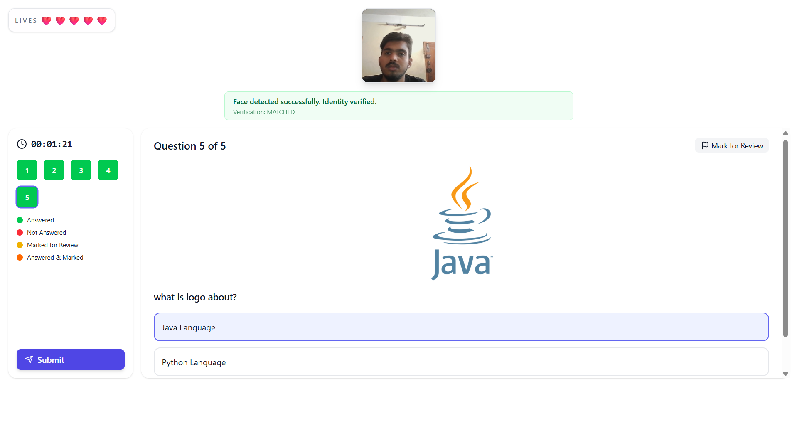

# Aptitude exam conduction platform

An end-to-end aptitude exam conduction platform with separate backend, user frontend, admin frontend, and a Python proctoring service.

This repository contains four connected parts:

- `QuizeBackend/` - Spring Boot API for authentication, quizzes, attempts, results, certificates, analytics, file uploads, and proctoring integration
- `quiz_project_user/` - student/user-facing React app for taking quizzes
- `quiz_project_admin/` - admin React dashboard for managing the platform
- `python-proctoring-poc/` - FastAPI-based proctoring proof of concept with face detection and identity verification

## Platform Preview

Here is a preview of the exam view interface during a quiz attempt:



## What the platform does

This project is built for aptitude exam conduction with support for:

- user registration and login
- quiz browsing and attempt flow
- timed quiz execution
- certificate generation
- result and history tracking
- admin quiz and user management
- AI-assisted proctoring
- identity verification
- life-based violation handling
- competition-mode exam monitoring

## High-level architecture

```text
quiz_project_user     ->  QuizeBackend  <-  quiz_project_admin
                                  |
                                  v
                     python-proctoring-poc
```

- The React user app talks to the Spring Boot backend for all quiz and attempt actions.
- The React admin app uses the same backend for management screens.
- The Python proctoring service provides live face/identity monitoring for quiz attempts.
- The backend stores quiz, attempt, proctoring, and identity-verification data in PostgreSQL.

## Project features

### User side

- Login, register, forgot password, reset password
- Dashboard with available quizzes
- Quiz details and attempt screen
- Fullscreen quiz flow
- Attempt result, history, profile, and leaderboard
- Proctoring indicators during exam attempts

### Admin side

- Admin login
- Dashboard summary
- Category management
- Quiz management
- Question management
- Results review
- Feedback review
- User management
- Certificate template management

### Backend

- JWT security
- role-based access control
- PostgreSQL persistence
- email support
- file uploads
- quiz lifecycle APIs
- attempt/result APIs
- proctoring APIs
- identity verification APIs

### Python proctoring service

- face detection
- multiple-face detection
- reference face capture
- identity verification
- live session monitoring
- violation and life tracking
- WebSocket frame processing

## Repository layout

- `QuizeBackend/README.md` - backend setup guide
- `quiz_project_user/README.md` - user frontend guide
- `quiz_project_admin/README.md` - admin frontend guide
- `python-proctoring-poc/README.md` - proctoring service guide

## Recommended setup order

1. Start PostgreSQL and create the backend database.
2. Run `QuizeBackend` first.
3. Run `python-proctoring-poc` if you want live proctoring/identity monitoring.
4. Run `quiz_project_user` for the student experience.
5. Run `quiz_project_admin` for the admin experience.

## Quick start

### 1) Backend

Open `QuizeBackend` in IntelliJ IDEA and run `QuizeBackendApplication.java`.

Default backend URL:

- `http://localhost:8081`

### 2) Python proctoring service

```bash
cd "C:\Users\prava\Java Developer Projects\QuizApp Complex Project\python-proctoring-poc"
python -m venv venv
venv\Scripts\activate
pip install -r requirements.txt
uvicorn app.main:app --reload
```

Default proctoring URL:

- `http://localhost:8000`

### 3) User frontend

```bash
cd "C:\Users\prava\Java Developer Projects\QuizApp Complex Project\quiz_project_user"
npm install
npm run dev
```

### 4) Admin frontend

```bash
cd "C:\Users\prava\Java Developer Projects\QuizApp Complex Project\quiz_project_admin"
npm install
npm run dev
```

## Environment variables

Each subproject has its own configuration.

### `QuizeBackend/`

Common variables:

- `DB_URL`
- `DB_USERNAME`
- `DB_PASSWORD`
- `JWT_SECRET`
- `BOOTSTRAP_ADMIN_EMAIL`
- `BOOTSTRAP_ADMIN_PASSWORD`
- `MAIL_HOST`
- `MAIL_PORT`
- `MAIL_USERNAME`
- `MAIL_PASSWORD`
- `AI_BASE_URL`
- `AI_MODEL`
- `CORS_ALLOWED_ORIGINS`
- `UPLOAD_DIR`

### `quiz_project_user/`

- `VITE_API_BASE_URL`
- `VITE_PROCTORING_API_URL`
- `VITE_PROCTORING_WS_URL`

### `quiz_project_admin/`

- `VITE_API_BASE_URL`

### `python-proctoring-poc/`

- Uses `.env` loaded by `app/config.py`
- Defaults are already defined in code

## How the exam flow works

1. A user logs in through the student app.
2. The user selects a quiz and starts an attempt.
3. The backend creates and tracks the quiz attempt.
4. If proctoring is enabled, the user captures a reference face.
5. The Python service continuously inspects incoming frames.
6. The backend records violations, updates lives, and calculates risk.
7. The quiz is auto-submitted when the configured limit is reached.
8. The user sees the result page and can review history later.
9. Admins can review quizzes, results, feedback, users, and certificate templates.

## Database and migrations

If the backend schema needs to be updated, use the SQL scripts in `QuizeBackend/`:

- `FIX_DATABASE.sql`
- `IDENTITY_VERIFICATION_MIGRATION.sql`
- `src/main/resources/db/proctoring_migration.sql`

## Tech stack

- **Backend:** Java 17, Spring Boot, Spring Security, Spring Data JPA, PostgreSQL
- **User/Admin UI:** React 19, Vite, React Router, React Query, Tailwind CSS
- **Proctoring service:** Python, FastAPI, WebSockets, OpenCV, MediaPipe, DeepFace

## Running locally

For the smoothest setup:

- keep PostgreSQL running
- start `QuizeBackend` first
- start `python-proctoring-poc` if you want proctoring features
- start `quiz_project_user` and `quiz_project_admin` after the backend is available
- make sure each frontend `.env` points to the correct backend URL

## Notes

- The backend runs on port `8081` by default.
- The Python proctoring service runs on port `8000` by default.
- The user frontend typically runs on `3000`.
- The admin frontend typically runs on `5173` as well, so run them in separate terminals and change the port if needed.
- Open the backend project in IntelliJ IDEA for the easiest Java setup.

## Project status

This platform is structured for a full aptitude-exam workflow and is designed to support both normal quiz delivery and monitored competition-mode assessments.

